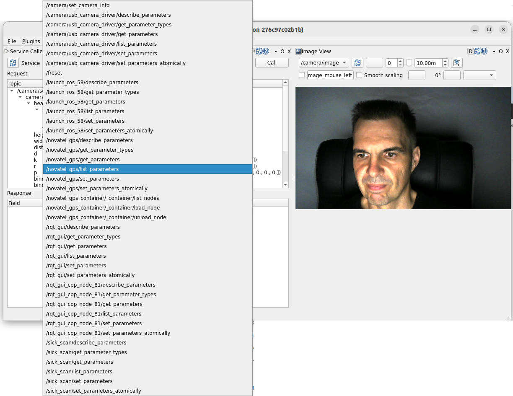

# Система управления оборудованием автономного самоходного робота PhotoBot

## Требования к системе

В качестве хост-системы должна быть GNU/Linux, для поддержки всех возможностей, желательно Ubuntu Linux 20+.

В системе необходимо установить последние версии Docker и Docker Compose.

## Установка и запуск

1. Для поддержки графического интерфейса, нужно предоставить доступ Docker-y к дисплею. Запустите команду

```bash
xhost +local:docker
```

2. Проверьте и при необходимости измените основные параметры доступа к оборудованию, которые находятся в переменных окружения в файле docker-compose.yml:

* `LIDAR_IP_ADDRESS` - IP-адрес лидара
* `LIDAR_SCANNER_TYPE` - тип лидара
* `USB_CAMERA_DEVICE_NUMBER` - номер устройства USB-камеры
* `GPS_DEVICE_PATH` - путь к устройству GPS-приемника
* `ODRIVE_CAN_INTERFACE` - название CAN-интерфейса контроллера двигателей колес

Установленные пакеты управления оборудованием имеют значительно больше параметров, чем доступно через переменные окружения. Другиме параметры можно добавить напрямую в файл автозапуска photobot_ws/src/photobot/launch/photobot.launch.py .

Информацию о доступных параметрах для каждого пакета можно узнать в документации на страницах этих пакетов:

* USB-камеры: https://github.com/klintan/ros2_usb_camera
* GPS-приемники NovaTel: https://github.com/swri-robotics/novatel_gps_driver   
* Лидары SICK: https://github.com/SICKAG/sick_scan_xd 
* IMU-датчикои XSens MTI-1: https://github.com/DEMCON/ros2_xsens_mti_driver
* Контроллеры двигателей колес ODrive: https://github.com/odriverobotics/ros_odrive

3. Запустите контейнер с помощью Docker Compose:

```bash
docker compose up
```

После изменения любых файлов в контейнере, включая photobot.launch.py, docker-compose.yml нужно остановить и пересобрать контейнер с помощью следующей последовательности:

```bash
docker compose down
docker compose build
```

## Работа в системе

После успешного запуска должен появиться графический интерфейс Rqt. Изначально он пустой, но с помощью плагинов его можно настроить, например, для считывания данных из топиков, которые передают узлы датчиков или посылать команды оборудованию с помощью сервисов.

Например, вот так может выглядеть интерфейс, настроенный на получения видео с топика `/camera/image` USB-камеры:



Также, в контейнере установлен OpenSSH сервер, который доступен хосту через порт 2022. Чтобы подключиться по SSH, выполните команду:

```bash
ssh -p 2022 root@localhost
```

Логин: `root`
Пароль: `root`